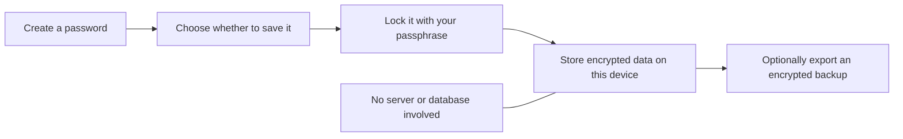
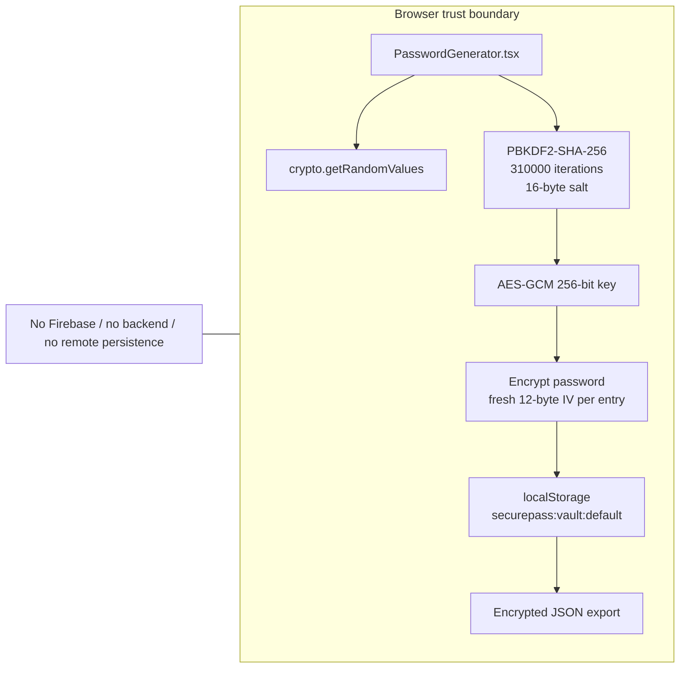
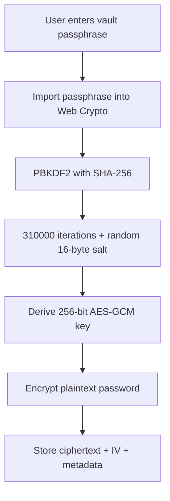
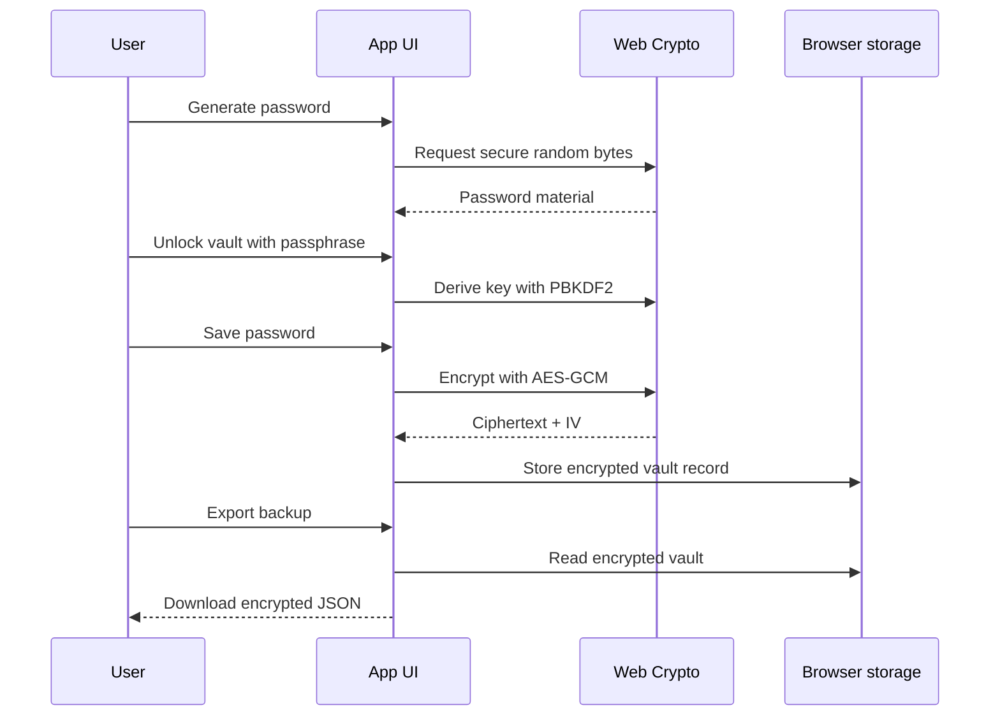

# SecurePass

SecurePass is a Next.js + TypeScript password generator with a local encrypted vault. It runs entirely in the browser, requires no account, and is configured for a simple Netlify MVP deploy.

## Security Model

SecurePass is intentionally designed as a client-side security project rather than a cloud password manager. The goal is to demonstrate practical browser-based cryptography, local secret handling, and a clear trust boundary.

### Read this section in two layers

- Plain-language summary: SecurePass creates passwords in the browser, encrypts saved entries before storing them, and never sends vault data to a backend.
- Engineering summary: Passwords are generated with `crypto.getRandomValues`, encrypted with `AES-GCM`, and protected by a key derived from the vault passphrase using `PBKDF2` with a random salt.

### Visual overview for non-technical readers



Everything in that diagram happens in the browser. The app is designed so the user's device is the storage location and trust boundary.

### Visual overview for technical readers



### Threat model

- Protect stored vault contents from casual inspection of browser storage.
- Avoid transmitting secrets to a backend, third-party API, or database.
- Keep the cryptographic workflow visible and auditable in the client code.
- Accept that this is a local-first MVP, not a full zero-knowledge multi-device platform.

### Password generation

- Password generation uses `crypto.getRandomValues`, not `Math.random`.
- The generator uses rejection sampling to avoid modulo bias when mapping random bytes into a character set.
- At least one character from each enabled character class is inserted before the final shuffle, so a password cannot accidentally omit a selected category.
- The final password is shuffled with a cryptographically backed Fisher-Yates-style pass so the required characters do not remain in predictable positions.

### Vault encryption flow



- A vault passphrase is never stored directly.
- The passphrase is imported into Web Crypto and used as the input to `PBKDF2`.
- Key derivation uses:
  - `SHA-256`
  - `310000` iterations
  - a random `16-byte` salt
- The derived key is an `AES-GCM` `256-bit` key used for entry encryption and decryption.
- Each saved password gets its own fresh `12-byte` IV.
- The stored record contains ciphertext, IV, metadata, and salt, but not the plaintext password or derived key.

### Storage model

```text
localStorage
└── securepass:vault:default
    ├── version
    ├── salt
    └── entries[]
        ├── id
        ├── nickname
        ├── ciphertext
        ├── iv
        └── createdAt
```

| Stored in browser | Not stored in browser |
| --- | --- |
| Salt | Plaintext vault passphrase |
| Ciphertext | Derived AES key |
| IV per entry | Plaintext saved passwords |
| Nickname and timestamp metadata | Any server-side session |
| Encrypted JSON backup on export | Any cloud copy created by the app |

- Vault data is stored in `localStorage` under a namespaced key: `securepass:vault:default`.
- The local vault record is versioned and currently contains:
  - `salt`
  - `entries[]`
- Each entry stores:
  - `id`
  - `nickname`
  - `ciphertext`
  - `iv`
  - `createdAt`
- Ciphertext and IV are base64-encoded for storage portability.
- No Firebase, login, database, cookies, or server-side session layer exists in the active app path.

### Unlock behavior

- Unlocking the vault derives the AES key from the current passphrase and stored salt.
- If encrypted entries already exist, SecurePass attempts to decrypt the first one as a correctness check.
- If decryption fails, the unlock is rejected and the vault remains locked.
- The derived `CryptoKey` lives only in browser memory while the vault is unlocked.
- Locking the vault clears the in-memory key reference and the decrypted working state held by the UI.

### Backup and migration

- Export produces a JSON backup of the encrypted vault contents, not plaintext secrets.
- The backup includes:
  - vault version
  - export timestamp
  - salt
  - encrypted entries
- Import replaces the current local vault with the imported encrypted record.
- To use an imported vault, the user still needs the original passphrase because the encryption key is derived from that passphrase plus the stored salt.

### Security boundaries and limitations

- This design protects data at rest in browser storage better than plaintext local storage.
- It does not protect against an attacker who can execute JavaScript in the same browser context.
- It does not protect against malware, a compromised endpoint, malicious browser extensions, shoulder surfing, or clipboard interception after a password is copied.
- It does not provide account recovery, remote wipe, device synchronization, or hardware-backed key storage.
- The password strength meter is heuristic and UX-oriented; it is not a formal entropy calculation.
- `localStorage` was chosen for portability and simplicity in a frontend MVP. For a higher-assurance design, I would evaluate IndexedDB, a stricter CSP, safer secret handling around clipboard operations, and a more formal backup/import integrity model.

## How It Works

### High-level flow

1. The user selects password parameters and generates a password locally.
2. If the user wants persistence, they unlock the local vault with a passphrase.
3. SecurePass derives a key with PBKDF2 and uses AES-GCM to encrypt the password before storage.
4. Encrypted entries are saved to browser storage only.
5. Export/import moves encrypted vault data between devices without exposing plaintext passwords.

### Request-to-storage path



### Code walkthrough

- `src/components/PasswordGenerator.tsx`
  - UI state
  - cryptographically secure password generation
  - unlock / lock / save / copy / import / export flows
- `src/context/localVault.ts`
  - storage record format
  - base64 conversion helpers
  - salt creation
  - PBKDF2 key derivation
  - AES-GCM encrypt / decrypt helpers
  - backup export / import helpers
- `src/components/PasswordStrengthMeter.tsx`
  - lightweight heuristic scoring for UX feedback

### Why this repo exists

This project is part of my transition from information security analysis into security engineering. I wanted a small codebase where I could demonstrate:

- practical use of Web Crypto in a browser application
- explicit security tradeoff decisions
- local-first secret storage instead of defaulting to cloud persistence
- clear reasoning about threat boundaries, assumptions, and residual risk

## Features

- Configurable password generation.
- Password strength indicator.
- Copy to clipboard.
- Local encrypted vault with lock/unlock flow.
- Encrypted vault export/import for device migration and backup.
- Static export configuration for Netlify hosting.

## Getting Started

1. Install dependencies:

   ```bash
   npm install
   ```

2. Start dev server:

   ```bash
   npm run dev
   ```

3. Open `http://localhost:3000`.

## Netlify Deploy

- Build command: `npm run build`
- Publish directory: `out`
- The included `netlify.toml` already matches this setup.

## Notes

- Vault contents are device/browser-local and do not sync across devices.
- If you forget the vault passphrase, existing saved entries cannot be decrypted.
- Importing a backup replaces existing local vault data in that browser.
